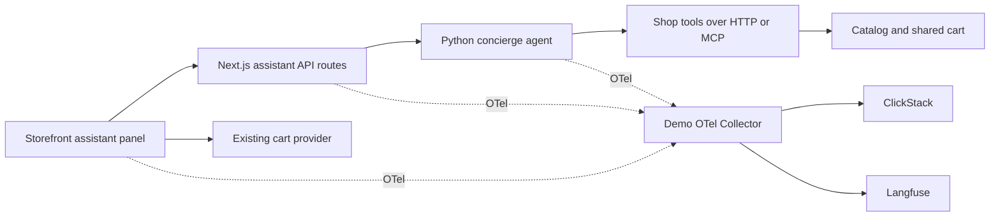

# Native Astronomy Shop assistant

Status: implemented, September 11, 2026 (harness plan `feat-native-assistant-ui`, tasks 1–8). Scope was native storefront UI, the agent contract changes it needs, and locally runnable container images; EKS and other deployment work remain deferred. `README.md` documents the run; `docker/README.md` the images. Deviations from the text below:

- The proxy image is `astronomy-concierge-frontend-proxy` (the service name), not `astronomy-concierge-proxy`.
- The storefront API has four routes, not two: `message`, `action` (card **Add to cart**, so a mutation is one instrumented, deduplicated agent action), `feedback`, and `conversation/[id]` (the status route that page reload resumes from).
- The browser turn span lives in `utils/telemetry/AssistantTracing.ts`, because the released frontend Dockerfile copies fixed directories and `utils/assistant/` would not reach the image.
- The turn's identity attributes land on Next's `executing api route` span, the only span a handler can reach; the HTTP server span carries `http.route`. Both stay in one trace and both are retained for Langfuse.
- The Envoy template routes `/api/assistant/` through a second cluster, `frontend-assistant` (same address as `frontend`), because the proxy's egress span carries no URL and the cluster name is what lets the Langfuse filter keep it.
- The panel has no scenario selector: `backend-failure` and `budget-violation` are chosen in the optional Gradio debug client; the native panel sends the default `shopping` scenario, and the CLI still toggles the real catalog fault.
- Sending a message clears the composer (the text stays in the transcript and **Retry** reuses the request id); the draft is restored only when the failure is not retryable.
- Images were built and tested for `linux/arm64` only; `linux/amd64` is untested. Token streaming and session replay were not added, as planned.

## Outcome

A shopper opens **Shopping assistant** from the Astronomy Shop header, asks for a telescope recommendation, inspects a product card, and adds an item to the same cart used by the storefront. The conversation stays available while the shopper visits product pages and the cart. The interface uses the shop's existing React components and visual theme. The Python agent continues to run as an internal service.

## Starting point

- This project extends OpenTelemetry Demo **3.0.0**, commit `1755859a9de82c2e5e225be68abc401a5ebf2b4f`. The backend already implements catalog lookup, scoped cart tools, conversations, feedback, and OTel instrumentation.
- The inspected frontend uses Next.js Pages Router, React, styled-components, React Query, and shared theme/cart/currency providers. `Layout` composes the header, page content, and footer.
- The released frontend Dockerfile builds the Next.js standalone server and packages it with its existing Node telemetry bootstrap. Agent and MCP Dockerfiles already define the Python dependencies and source layout.
- The current local overlay mounts Python code and prompts into released containers. It does not yet build images containing our changes. The launcher pins the shop images and starts Compose with `--no-build`.

Use the existing 3.0.0 release baseline throughout this work. The other repository, its source pin, Helm configuration, registry, and infrastructure are not dependencies of this implementation.

## User experience and visual design

Recommended placement: a persistent assistant panel, accessible from the header on the home, product, and cart pages.

| Area | Design |
| --- | --- |
| Entry point | A labeled **Shopping assistant** control beside the currency and cart controls. On narrow screens, use a compact labeled entry in the header without squeezing the logo or cart. |
| Desktop panel | A right-side panel approximately 400–440 px wide, capped by viewport width. Keep the catalog visible. Closing the panel preserves the conversation. |
| Mobile panel | A full-screen dialog with a clear title, close control, scrollable transcript, and composer above the software keyboard. Use the existing 768 px breakpoint. |
| Visual language | Reuse Open Sans, `Theme`, the blue `#5262A8`, yellow `#EAAA3B`, white surfaces, gray text/borders, and the existing button/input corner treatment. Reference theme values and shared primitives in code. |
| Empty state | “Find the right telescope” with three suggestions such as “A telescope for a beginner,” “Help me choose under $150,” and “Explain this product.” Show the active budget and currency clearly. |
| Product context | Add **Ask about this product** on product pages. It opens the same panel and supplies the product ID as context; it does not create a separate conversation. |
| Recommendations | Compact catalog-backed cards with image, name, price, **View product**, and **Add to cart**. Reuse the existing price formatting and product visual treatment. |
| Progress | Show observable activity: “Looking up products” or “Adding to your cart.” With the current non-streaming API, use a general pending state until real step events are available. |
| Feedback | Helpful / Not helpful on each completed assistant answer, attached to that answer's trace. Reflect whether saving succeeded. |
| Failure | An inline recoverable error keeps the transcript and shopper input. An agent outage leaves normal catalog/cart browsing functional. |
| Demo controls | A collapsed, deployment-configurable **Demo details** area holds scenario, prompt version, tool activity, and trace links. The shopper-facing panel stays focused on shopping. |

Build the panel as native React UI in the storefront. The normal user journey no longer depends on the Gradio application. Keep Gradio only as an optional development/debug client during migration.

First visual milestone: a working frontend-only panel using fixtures, shown on actual home/product/cart pages at desktop and mobile sizes. Review empty, pending, recommendation, cart-success, and failure states before connecting live tools. This milestone uses the real theme and components rather than a separate mockup design system.

## Components and API boundary



Proposed frontend files, relative to the demo's `src/frontend/`:

| Location | Responsibility |
| --- | --- |
| `providers/Assistant.provider.tsx` | Conversation state, panel visibility, pending request, context, and transcript; mounted inside the existing cart/currency provider tree above page components. |
| `components/Assistant/` | Panel, composer, messages, compact product cards, feedback, and optional demo details. |
| `components/Header/Header.tsx` | Entry point and responsive layout. |
| `components/Layout/Layout.tsx` | One panel host per page layout, backed by persistent provider state. |
| `pages/product/[productId]/index.tsx` | Contextual “Ask about this product” action. |
| `gateways/Assistant.gateway.ts` | Typed same-origin requests using the app's request/telemetry conventions. |
| `pages/api/assistant/message.ts` | Validate browser input, call the internal agent, preserve trace context, and return the UI contract. |
| `pages/api/assistant/feedback.ts` | Forward feedback through the existing backend ownership checks. |
| `types/Assistant.ts` | Versioned request, reply, product reference, action, and error types. |

The browser calls only same-origin storefront endpoints. Agent/model/Langfuse addresses and credentials stay in server-side configuration. Use explicit upstream request deadlines and an assistant-specific frontend-proxy timeout compatible with the backend's 90-second limit. Leave ordinary shop route timeouts unchanged.

The first delivery can use the existing request/response transport. Token streaming is a later enhancement: it requires backend events, cancellation behavior, proxy buffering/timeouts, and trace lifecycle tests. Do not animate invented tool activity or simulate streaming.

## Shared cart and conversation contract

This requires backend work, not just embedding the existing chat UI. Today the agent uses its conversation UUID as its cart ID; the storefront has a different localStorage session ID.

1. Separate `conversation_id` from `shop_session_id` in the agent contract. Obtain the latter from the existing storefront `SessionGateway`; bind a conversation to that cart ID when it is created. Reject attempts to rebind an existing conversation.
2. Keep the cart ID out of model-controlled tool arguments. The server injects the bound ID into both HTTP and MCP tool calls. This follows the demo's anonymous cart model; a client-supplied ID is not authentication.
3. **New conversation** clears agent context and starts a new conversation ID while preserving the storefront cart. Closing/reopening the panel and navigating between pages preserve conversation state.
4. Return structured `product_refs` and `cart_changed` fields alongside `reply`, `conversation_id`, `trace_id`, feedback capability, and optional demo details. Derive product references from validated tool results, never by parsing prose or trusting model-generated prices/URLs.
5. On a successful agent cart mutation, invalidate React Query's existing `['cart']` queries. The header count, dropdown, and cart page refresh through `CartProvider`.
6. Route the assistant card's **Add to cart** action through an explicit agent action so it is instrumented once and follows the same scope rules. Do not also call the storefront add mutation for the same click.
7. Share the storefront currency selection. Extend the agent/tool contract to use current currency-service conversions for displayed prices and budget comparisons. Preserve original amounts/currency in context; never relabel USD as another currency. Currency changes refresh cards and cart data and update the next turn's context.
8. Allow one in-flight turn per conversation. Assign request IDs and deduplicate retries in the live agent process, especially cart mutations. Do not automatically retry a timed-out mutation; refresh the cart first. In-memory deduplication does not survive a restart, so an uncertain post-restart outcome must be shown as uncertain.
9. Keep history across page navigation. For page reloads, either resume from a server conversation-status endpoint or explicitly start fresh; do not display a restored transcript while silently losing the agent's matching context. Surface session expiry/restart with a clear new-conversation state.

Retain the existing plain-chat endpoint during the transition so the standalone debug client remains usable. Add compatibility tests or an adapter rather than changing its semantics silently.

## OTel and Langfuse

Reuse the active browser tracing provider. Add a semantic `assistant.turn` span around each submitted turn; ensure async context stays active through the fetch and that the span ends only when the response completes or fails. Preserve W3C trace context through the Next.js API, agent, MCP, and shop calls.

Keep the application identifiers distinct:

| Identifier | Meaning |
| --- | --- |
| Storefront session/cart ID | Existing anonymous shopper/cart continuity. |
| Assistant conversation ID | Agent history; use `gen_ai.conversation.id` and `langfuse.session.id` consistently on assistant observations. |

Record explicit mappings on the assistant boundary spans. Verify browser-to-server correlation with the release's existing OTel browser provider. Do not install a second browser tracing provider. A future session-replay integration can reuse this boundary; adding or porting that integration is outside this iteration.

**Update the Langfuse filter as part of the UI integration.** The current agent/chatbot/MCP service allowlist would drop the new browser and frontend parents. Mark assistant interactions and their enclosing transport spans early enough to retain the full ancestor chain. Include required browser/frontend ancestors without forwarding unrelated storefront traffic. Prove this with captured traces; do not ship an attribute-only filter that leaves orphaned observations. If the active browser SDK cannot mark its transport spans reliably, broaden the narrow assistant-route filter rather than inventing parent spans or breaking the trace into a second trace.

ClickStack continues to receive shop telemetry through the existing collector path. Langfuse receives OTel traces plus the existing prompt/score API operations. Retain generation usage, prompt linkage, tool errors, and feedback-to-answer correlation. Use synthetic demo data and define capture/masking behavior for the composer and responses explicitly.

Reference: [Langfuse OTel propagation and root-span guidance](https://langfuse.com/integrations/native/opentelemetry).

## Container builds and local execution

Keep all application changes, Dockerfiles, build scripts, and Compose overrides in this repository. The output is a set of runnable images and a local Compose entry point; registry publishing and deployment automation are deferred.

| Image | Build approach | Contents |
| --- | --- | --- |
| `astronomy-concierge-frontend` | Reuse the pinned release's multi-stage frontend build and `npm ci` lockfile workflow. | Native assistant components, API routes, static assets, and existing frontend OTel initialization. |
| `astronomy-concierge-agent` | Extend the released 3.0.0 agent image, resolving and pinning its base digest. | Concierge Python package, prompts, corrected shop tools, and `concierge.run_agent` entry point. Add locked dependencies only if implementation requires them. |
| `astronomy-concierge-mcp` | Extend the corresponding released MCP image with a pinned base digest. | Corrected shop tools, conversation telemetry support, and `concierge.run_mcp` entry point. Used when MCP transport is selected. |
| `astronomy-concierge-proxy` | Extend the released frontend-proxy image with a pinned base digest. | The assistant-specific route/timeout configuration, retaining the existing shop and OTLP routes. |

Build mechanics:

1. Store new frontend files under a versioned overlay and modifications to existing upstream files as a checked patch. Stage a clean build tree under `.runtime/build/` from the exact 3.0.0 commit; keep `.upstream/` unchanged. Fail if the source pin or patch preconditions do not match.
2. Use explicit build contexts and `.dockerignore` rules. Include only required source, lockfiles, Dockerfiles, and patches; exclude `.env`, credentials, captures, virtual environments, and unrelated runtime files.
3. Give the image set a shared content-derived release tag covering the upstream commit, base digests, Dockerfiles, lockfiles, frontend overlay/patch, Python code, prompts, and proxy configuration. Record image IDs, target platform, and API contract version in a build manifest.
4. Add a `build` command to `scripts/demo.py` with service selection and a target-platform option. Build and load the local host platform by default. Support separate `linux/arm64` and `linux/amd64` builds; only claim support for architectures actually built and smoke-tested. Multi-platform registry publication can come later.
5. Add a native Compose override that selects these custom images per service. Keep the unchanged shop services pinned to 3.0.0. Do not change `DEMO_VERSION` globally to the custom tag.
6. Bake application source, prompts, and the tool fix into images. The normal native run must work without application-code bind mounts. Generated collector configuration and runtime data mounts can remain. Put source bind mounts behind an explicit development override.
7. Route the frontend API to the internal agent service with server-side `AGENT_BASE_URL`. Keep model/Langfuse credentials runtime-only. The browser uses the existing shop URL, normally `http://localhost:8080/`.
8. Make the native storefront the default launcher output and entry point. Remove the Gradio chatbot from the default native service set, including inherited Compose dependencies that would start it. Retain an explicit debug option for it.
9. Use one agent instance with documented in-memory conversation lifetime. Restarting the agent must produce the planned session-expiry/reset behavior in the UI.

Proposed command flow after implementation:

```sh
.venv/bin/python scripts/demo.py bootstrap
.venv/bin/python scripts/demo.py build
.venv/bin/python scripts/demo.py up
# Open http://localhost:8080/
```

`build` does not exist yet; adding it and the native image selection is part of the work. Keep `up` independent of compilation and report clearly when the required local images have not been built.

## Delivery sequence

| Step | Deliverable | Completion check |
| --- | --- | --- |
| 1. Build the native shell | Versioned frontend overlay, assistant provider, header control, desktop/mobile panel, transcript/composer, fixture product cards. | Visual review on real home/product/cart pages; keyboard and responsive behavior work. |
| 2. Establish container builds | Clean build staging, custom frontend/agent/MCP/proxy images, manifest, and native Compose override. | The fixture UI runs through port 8080 from built images without source mounts. |
| 3. Connect the agent | Typed same-origin API, internal agent call, pending/error states, feedback per answer. | A real catalog recommendation appears inside the storefront. |
| 4. Unify shopping state | Separate cart/conversation IDs, structured cards/actions, cart invalidation, currency support, retry behavior. | Assistant adds update the storefront cart immediately; conversations and carts remain correctly isolated. |
| 5. Verify observability | Browser/frontend parent spans, identity mappings, and Langfuse filter. | One correlated trace with complete ancestry and correct feedback association. |
| 6. Validate the packaged app | Final image rebuild, native browser tests, HTTP/MCP smoke runs, and local build/run documentation. | A clean bootstrap → build → up produces the complete native experience from the recorded image set. |

## Acceptance tests

- At 1440, 1024, 768, and 390 px widths, the panel matches the storefront's font, colors, controls, spacing, and product presentation. It does not hide the cart control or overflow the viewport.
- Keyboard users can open, navigate, submit, and close the assistant. The mobile dialog traps focus, Escape closes it, and focus returns to the trigger. The desktop panel has a coherent nonmodal focus order. Status updates use appropriate live regions; controls retain visible focus and contrast.
- Ask for a beginner telescope, inspect a real product, add it, open the cart, and see the same item/count. No duplicate add occurs on a repeated click or retry.
- Navigate home → product → cart and close/reopen the panel without losing the conversation. New conversation preserves cart contents; a different browser session has a separate cart.
- USD and at least one non-USD currency produce consistent displayed prices and budget comparisons. Product context and prices come from real tool results.
- Catalog errors and agent outages are recoverable in the panel. Normal shop interactions remain available. Expired conversations and uncertain mutation outcomes are explicit.
- Frontend type-check/build and targeted Cypress tests pass, alongside the existing Python agent tests and real HTTP/MCP smoke tests.
- Captured OTel traces contain one assistant turn, real tool calls, correct conversation IDs, and no missing retained parents or duplicate browser instrumentation. Langfuse shows the corresponding prompt/generation/feedback once instance access is configured.
- A clean container build includes every application/patch input and records base digests, platform, and image IDs. Changing frontend code or a prompt changes the content-derived image-set tag.
- The native Compose stack runs without application-code bind mounts or the Gradio service. Browser requests use the shop origin, and credentials are absent from the browser bundle and image build context.
- The built frontend starts correctly in its final runtime stage with OTel enabled, and the built agent/MCP images pass real-tool smoke tests. Report architecture coverage from actual build/run results.

## Inspected implementation references

- Local release frontend: `.upstream/opentelemetry-demo/src/frontend/`, especially `styles/Theme.ts`, `components/Layout/`, `components/Header/`, `providers/Cart.provider.tsx`, `gateways/Session.gateway.ts`, and `utils/telemetry/FrontendTracer.ts`.
- Released builds: `.upstream/opentelemetry-demo/src/frontend/Dockerfile`, `src/agent/Dockerfile`, and `src/mcp/Dockerfile` under the same checkout.
- Local container wiring: `compose.concierge.yaml` and `scripts/demo.py`.
- Existing agent and telemetry: `concierge/agent.py`, `concierge/telemetry.py`, `scripts/demo.py`.
